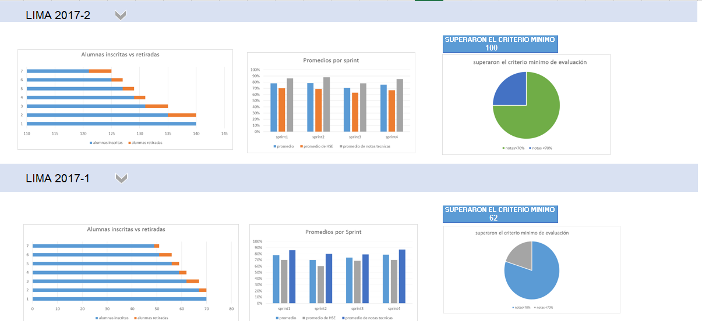

# DASHBOARD
En el dashboard, los usuarios mencionados pueden ver rápidamente estadísticas y datos en tiempo real como:

Numero de alumnas inscritas  
numero de alumnas que desertaron  
numero y % de alumnas que pasan el criterio mínimo de evaluación  
Promedio de notas por sprint  
Promedio de notas HSE  
Promedio de notas técnicas  

En el scketch se muestran los datos solicitados. 
y se compara la sede con el año. Al hacer click en el sede debe aparecer una lista de la sede y el año para realizar la comparación.
 
